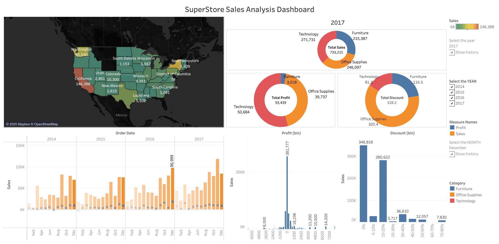

# 📊 SuperStore Sales Analysis Dashboard

This Tableau project presents an interactive dashboard that analyzes SuperStore sales data across multiple years, focusing on sales performance, profit distribution, and discount impact across U.S. states and product categories.

## 🧠 Insights Covered

- **Sales by Region:** State-level analysis using a choropleth map
- **Sales by Category:** Donut chart highlighting Technology, Furniture, and Office Supplies
- **Profit and Discounts:** Insightful visualizations for total profit and average discount per category
- **Trend Over Time:** Monthly sales and profit trends from 2014 to 2017
- **Discount Impact on Sales:** Analysis of how varying discounts affect sales

---

## 📌 Features

- Interactive filters for **year**, **month**, and **measure names**
- Historical data comparison
- Clear breakdown by **Product Category**
- User-friendly visuals for both exploratory and explanatory analysis

---

## 🛠 Tools Used

- **Tableau Public**
- **SuperStore dataset**
